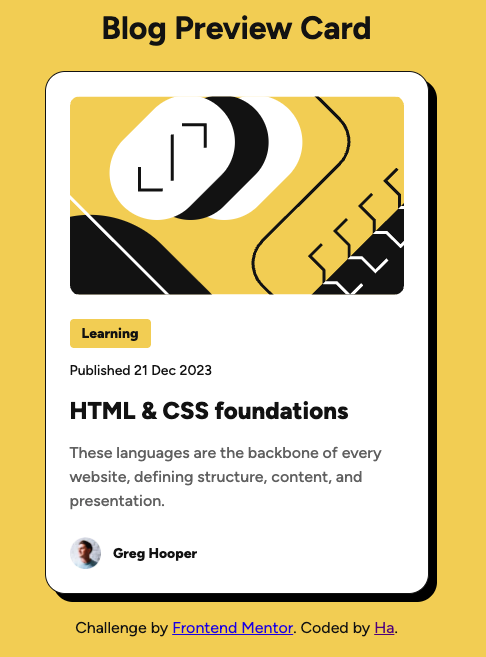

# Frontend Mentor - Blog preview card solution

This is a solution to the [Blog preview card challenge on Frontend Mentor](https://www.frontendmentor.io/challenges/blog-preview-card-ckPaj01IcS). Frontend Mentor challenges help you improve your coding skills by building realistic projects.

## Table of contents

- [Overview](#overview)
  - [The challenge](#the-challenge)
  - [Screenshot](#screenshot)
  - [Links](#links)
- [My process](#my-process)
  - [Built with](#built-with)
  - [What I learned](#what-i-learned)
  - [Continued development](#continued-development)
- [Author](#author)

## Overview

### The challenge

Users should be able to:

- See hover and focus states for all interactive elements on the page

### Screenshot



### Links

- Solution URL: https://github.com/hatran-hattt/frontendmentor-blog-preview-card-main.git
- Live Site URL: https://hatran-hattt.github.io/frontendmentor-blog-preview-card-main

## My process

### Built with

- Semantic HTML5 markup
- CSS custom properties
- Flexbox

### What I learned

#### A. CSS structure

1. Learn to organize css into separate files more effectively.

   ```
   Structure

     project/
     ├── css/
     │ ├── \_variables.css # All your design tokens (colors, typography, spacing)
     │ ├── \_base.css # Normalize/reset, global body styles
     │ ├── components/
     │ │ ├── \_blog_card.css # Styles for card component
     │ │ └── ...
     │ └── style.css # Main entry point, imports all others
   ```

   ```
   style.css example

       /* 1. Settings / Variables (Lowest Specificity) */
       @import url('_variables.css');

       /* 2. Generic / Base Styles */
       @import url('_base.css');

       /* 3. Components (Specific UI elements) */
       @import url('components/_card.css');
       /* ... */

       /* 4. Utilities (Highest Specificity - overrides) */
       /* @import url('utilities/_spacing.css'); */
       /* @import url('utilities/_text.css'); */
   ```

2. Design tokens

   > Reference: https://www.uxpin.com/studio/blog/what-are-design-tokens/
   >
   > Design tokens are the smallest, repeatable elements of a design system that store visual properties such as colors, typography, spacing, and shadows. They act as a bridge between design and code, providing a single source of truth that can be used across various platforms and technologies.

3. Normalize, Reset

   > Reference: https://www.geeksforgeeks.org/css/difference-between-reset-vs-normalize-css/
   >
   > - Ensuring a consistent user experience across different browsers can be a challenging task for web developers. Each browser has its built-in styles, which can vary depending on the operating system or the browser itself. This variation can lead to inconsistencies in how a webpage is displayed to users.
   > - To address this issue, developers use two main techniques: CSS Reset and Normalize CSS. Both methods aim to override the browser's default styles to achieve uniformity, but they do so in different ways.

4. CSS class naming convention: BEM Convention

   > Reference: https://www.geeksforgeeks.org/css/understanding-the-css-bem-convention/
   >
   > - The term BEM stands for Block-Element-Modifier, which is a naming convention for CSS class names that helps to maintain a clear and consistent structure in a project's styling
   > - BEM uses block, element, and modifier names to construct CSS class names, separated by double underscores (\_\_) and hyphens (-). It is based on the idea of breaking down a web page into smaller, reusable blocks of code. Each block consists of elements and modifiers that can be used to create variations of that block. This approach makes it easy to understand the purpose of each class and how they relate to each other. It allows developers to quickly understand the structure of a project's styling and make changes effectively.

#### B. CSS usage

1. Using self-hosted fonts:

- Import font files using @font-face syntax.

  - static font files

    ```
    @font-face {
      font-family: 'Figtree';
      src: url('./assets/fonts/Figtree-Regular.ttf') format('truetype');
      font-weight: 400;
      font-style: normal;
    }
    @font-face {
      font-family: 'Figtree';
      src: url('./assets/fonts/Figtree-Bold.ttf') format('truetype');
      font-weight: 700;
      font-style: normal;
    }
    ```

  - variable font file

    ```
    @font-face {
    font-family: "Figtree";
    src: url("../assets/fonts/Figtree-VariableFont_wght.ttf") format("truetype");
    font-weight: 100 900; /_ Range for variable font _/
    font-style: normal;
    }
    ```

- Use in css
  ```
  body {
    font-family: 'Figtree', sans-serif;
    font-weight: 400; /* or any weight in the supported range */
  }
  ```

2. Responsive design related tips

- Convert design tokens's absolute units (px, pt) to relative units (em, rem)

  ```
  /* Define a base font size for REM calculation */
  --base-font-size: 16;

  /* Spacing tokens */
  --spacing-300: calc(24 / var(--base-font-size) * 1rem);
  ```

- clamp() vs media queries:

* Use clamp() for simple, fluid scaling of individual properties (widths, font-sizes, paddings).
* Use media queries for more complex changes (layout shifts, hiding/showing elements, changing flex direction, etc.).

3. Pseudo-classes

   > Reference: https://web.dev/learn/css/pseudo-classes
   >
   > Example :hover, :focus, :active, ...

### Continued development

Learn & practice more effective structuring in front-end development.

## Author

- Frontend Mentor - [@hatran-hattt](https://www.frontendmentor.io/profile/hatran-hattt)
